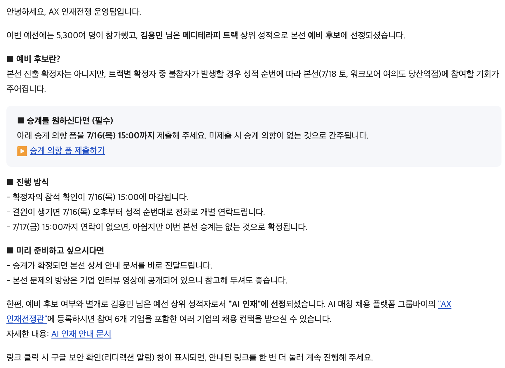

# AX-mediterapy-codex-plugin

## <**AX인재전쟁 - 메디테라피**>
- **본선 예비후보 선정작**

### <**대회 소개**>
- 기업에서 제시한 과제를 AX를 통하여 자동화
- 온라인 예선 통과 시, 본선 가능
- 참여 기업 : 메디테라피, 삼일 PWC, 마이리얼트립, 카카오증권페이, 채널톡, 무신사
- 이 중 메디테라피 기업 과제 제출작

### <**부여 상황**>
- **매출이 될 수 있는 인플루언서 시딩 시스템 설계해라!**
- 구조적 문제 3가지 해부
- 1번 : SNS 데이터 세계를 온톨로지 화
- 2번 : 데이터 중 인과관계 추정하는 일
- 3번 : 반복 가능한 루프로 설계 가능

### <**이외의 AX에 대한 대표님 생각 3가지**>
- 사람이 없는 새로운 시장에서도 시스템을 통해서 진출해서 성과를 낼 수 있는가
- 시스템이 내린 판단으로 돈을 낼 수 있는가
- 그게 더 똑똑한가

### <**내 생각**>
<**전제 조건 정리**>:
- 온라인 예선에선 데이터가 주어지지 않음, 스키마 또한 없음
- 시딩 시스템 설계 : 목표
- 시딩 시스템을 재정의 : "한정된 예산과 셀 수 없이 많은 크리에이터 풀이 있을 시, 누구에게 무엇을 언제 시딩?"
- 환경 : 새로운 시장 (불확실성 증대, 명확히 정의 되지 않은 시장)

<**분석**>
- 도메인 데이터는 해당 도메인 기업이기 때문에 많음 -> 많은 데이터 상의 규칙 정립 필요
- 분석 가능한 언어로 재설계 : 비정형화된 데이터(새로운 환경) -> 정형화된 데이터(온톨로지)-> 정보 혹은 규칙 정립 -> 이 속에서 시딩 시스템 설계

### <**AX 후보 포인트**>
- 1번 : 비정형화 -> 정형화 (온톨리지 설계)
- 2번 : 정형화된 데이터를 통한 시딩 시스템 연결
- 3번 : 시딩 시스템 설계
- 4번 : 데이터 상의 규칙 정립

### 의문 포인트
- 1번 : 우리는 모든 서비스를 설계해야 하나?
- 스스로 답변 : AX는 갈아 끼울 수 있는 모듈이라고 생각함. 어디까지가 서비스의 시작과 끝인지는 내가 정립하기 나름이라고 판단
- 2번 : 무엇에 유연하고 무엇에 닫혀 있어야 하나?
- 스스로 답변 : 수평적 확장(같은 Task)이라 판단되는 부분에는 유연히 확장 가능해야 하며 해결해 본 적 없는 Task에 대해서는 강하게 닫혀 있어야 함

### FDE의 시점에서 Wants와 Needs
- Wants : 자동화를 통하여 새로운 시장에 돈을 벌고 싶음
- Needs : 새로운 시장(자유, 무한 공간)에 누적된 데이터(정형, 유한 공간)를 통한 솔루션 설계 가능, 기존 지식을 정형 데이터로 변경, 누적 데이터를 통한 규칙 확립, 해당 규칙이 수익으로 이어질 수 있는 지에 대한 판단 로직 필요

### 구체적 설계 내용
- 온톨리지 설계 : 불가능이라 판단, 데이터 스키마 부재, 가짜 데이터를 활용할 경우 상상의 영역, 또한 온톨리지 설계는 데이터 분석가의 일이지 AX 해커톤의 시선으로 AX 엔지니어의 일이 아니라고 판단
- -> 아키텍처 설계에 집중
- 구조 설계 입장 : 무한 공간의 문제를 해결하기 위한 유한 공간의 해결법이란 존재 가능성은 존재.
- 하지만, 모순점 발생 -> 인간이 룰로 미리 정의하지 않은 부분은 LLM의 상상력에 의존 하지만, 누적된 상상력은 누적된 환각 가능성에 의존 - 단 한 번의 환각 발생은 전체 프로세스에 누적 적용
- 예컨데 : 1회 환각 발생 가능성이 0.1%라면 10회는 약 1%, 100회는 약 9.6% ,.... 반복할수록 증가. 자체 피드백 루프를 통한 성능 향상을 지향하는 현대 에이전트 시스템에 반대되는 모순
- 따라서 2가지 분리 필요 : 해석 - LLM, 규칙 정립  - 인간
- <**종합**>
- <**사용 기술**> : Z3 Solver는 다양한 제약 조건 내에서 해의 존재 가능성 여부 판단 / 충돌 발생 시, UNSAT를 통하여 충돌 지점에 대한 언급
- <**사용 추가 설명**> : Z3 Solver는 원래 해당 불리언 논리식을 참으로 만드는 변수 값의 조합이 존재하는 가를 다룸. 여기서 사용 방식은 SAT에 대한 것이 아닌 UNSAT 여부에 대한 정보를 판단하기 위하여 엔진으로서 사용
- <**배경 정립**> - 온톨로지 구축 완료 상태 가정
- <**1 Layer**> 온톨로지 -> Z3 Solver Symbol 변환
정형화된 온톨로지를 판정 엔진이 다룰 수 있는 Symbol 집합으로 변환
이 층의 목적 : 의미(온톨로지)를 논리(Symbol)로 옮겨 이후 제약 판정의 공통 입력 확보
표현만 다른 동일 의미는 하나의 정규(canonical) 형태로 정렬 -> 뒤 층이 일관된 데이터만 다루도록 보장
- <**2 Layer**> Symbol Context 구성 + 모호성 필터링
변환된 Symbol을 판정 가능한 컨텍스트로 정렬
이 지점에서 ambiguous(모호) / unknown(미지) 필드 분리 -> 인간이 정의하지 않은 영역을 판정 대상에서 격리
격리 이유 : 정의되지 않은 부분을 억지 판정할 경우 앞서 언급한 환각 누적 구조로 회귀하기 때문
- <**3 Layer**> Hard Constraint 판정 (Z3 Solver)
반드시 지켜져야 하는 규칙만 논리식으로 표현 -> Z3에 투입
SAT가 아닌 UNSAT 여부를 신호로 사용 : 충돌 발생 시 UNSAT
각 규칙에 rule id 부착(tracked) -> 어떤 규칙이 충돌을 유발했는지 역추적 가능
의미 : "안 됨"으로 끝나지 않고 "무엇 때문에 안 됨"까지 특정
- <**4 Layer**> Soft Conflict 판정 (Set Diff)
절대 규칙이 아닌 정도의 문제는 Z3가 아니라 집합 연산으로 처리
근거 기준선(evidence baseline)과 현재 Symbol 집합의 차이(diff) 계산
LLM 판단 배제 -> 결정론적 연산으로만 충돌 도출 (주관 개입 차단)
- <**5 Layer**> Status Decision (종합 판정)
Hard 결과(UNSAT/SAT) + Soft diff 결과를 하나의 상태로 수렴
서로 성격이 다른 두 신호를 최종 판정 하나로 결합하는 지점
- <**6 Layer**> Report 산출
판정 결과를 마케터가 읽을 수 있는 형태로 출력 (Markdown / JSON 선택)
전 단계 산출물은 debug로 분리 저장 -> 최종 결과는 불변, 판정 근거만 추적 가능
- <**설계 관통 원칙**>
해석은 LLM, 규칙 정립은 인간 -> 층을 명확히 분리
Hard는 Z3로 엄밀히 / Soft는 diff로 유연히 -> 성격 다른 판정을 다른 엔진에 위임
예측·랭킹·LLM 판단 배제 + rule id 추적 -> 모든 판정이 설명 가능(explainable)

<**증빙자료**>

